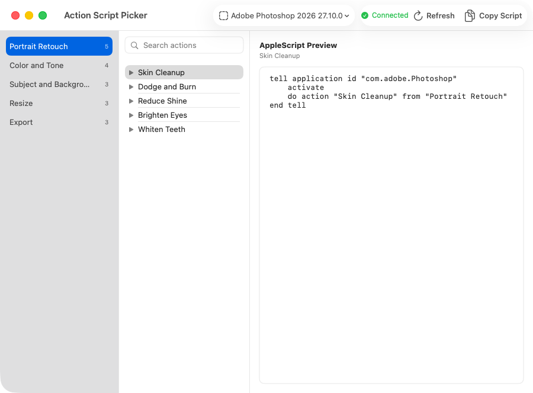

# Action Script Picker

Turn a Photoshop action into a ready-to-paste AppleScript.

<picture>
  <source media="(prefers-color-scheme: dark)" srcset="docs/images/action-script-picker-dark.png">
  
</picture>

Action Script Picker reads the actions already loaded in Photoshop. Pick one, copy the script, and paste it into Script Editor, Shortcuts, Stream Deck, or any other AppleScript runner. The app never runs the action itself.

[Download Action Script Picker 1.0.0](https://github.com/austinpresley/action-script-picker/releases/download/v1.0.0/Action-Script-Picker-1.0.0.zip)

## Use

1. Open Photoshop.
2. Open Action Script Picker and choose an action set and action.
3. Click **Copy Script**.
4. Paste the script where you need it.

Press Command-R to reload Photoshop actions. Press Command-F to search the selected set.

## Requirements

- macOS 13 or later
- Adobe Photoshop 2026 is tested. Other compatible versions are marked `Untested`.
- Apple Silicon or Intel Mac

The first refresh may show a macOS Automation prompt. Allow Action Script Picker to control Photoshop so it can read the Actions panel. The app does not need Accessibility or Full Disk Access.

## First launch

The download is hardened but not notarized. If macOS blocks it, Control-click the app in Finder, choose **Open**, then confirm. You only need to do this once.

## Build

Open `Action Script Picker.xcodeproj` in Xcode 15 or later, or build from Terminal:

```sh
xcodebuild -project "Action Script Picker.xcodeproj" \
  -scheme "Action Script Picker" \
  -configuration Release \
  -derivedDataPath build \
  ARCHS="arm64 x86_64" ONLY_ACTIVE_ARCH=NO build
```

Run the tests with:

```sh
xcodebuild -project "Action Script Picker.xcodeproj" \
  -scheme "Action Script Picker" \
  -configuration Debug \
  -derivedDataPath build-test test
```

## Privacy

Action Script Picker has no network access, analytics, telemetry, update checks, or diagnostic logs. It keeps loaded action names in memory and does not save them.

Released under the [MIT License](LICENSE).

Adobe Photoshop is a trademark of Adobe. Action Script Picker is not affiliated with or endorsed by Adobe.
